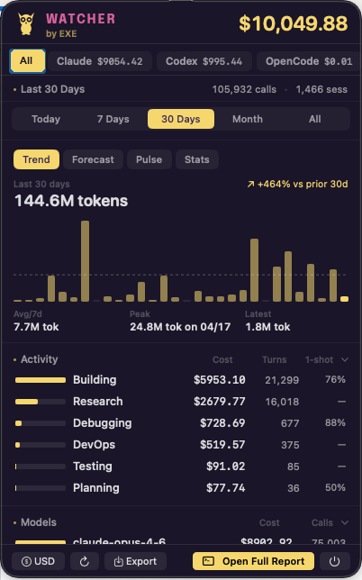

<p align="center">
  
</p>

<p align="center"><strong>The owl watching your AI coding spend — tokens, cost, models, agents, and projects in one beautiful terminal + macOS menu bar.</strong></p>

<p align="center">
  <a href="https://www.npmjs.com/package/exe-watcher"></a>
  <a href="https://www.npmjs.com/package/exe-watcher"></a>
  <a href="https://github.com/AskExe/exe-watcher/blob/main/LICENSE"></a>
  <a href="https://github.com/AskExe/exe-watcher"></a>
  <a href="https://discord.gg/pJ2DMWvtAx"></a>
</p>

<p align="center">
  
</p>

Exe Watcher turns your local AI coding sessions into a live spend cockpit: today's burn, provider/model mix, activity breakdown, one-shot rate, token trends, optimization hints, and project cost — without API keys, cloud sync, or wrappers around your tools.

```bash
npm install -g exe-watcher
```

---

## What makes it cool

- **Local-first spend tracking** — reads session data already on your machine; no telemetry service, no account, no proxy.
- **Terminal + native macOS menu bar** — run the full TUI in your terminal or keep today's spend visible in the menu bar.
- **Multi-provider view** — Claude Code, Codex, Cursor, Cursor Agent, Copilot, OpenCode, OMP, and Pi are auto-detected.
- **Actually useful metrics** — cost, calls, sessions, tokens, cache hit %, one-shot rate, activity type, model split, tools, MCP servers, shell commands, and top sessions.
- **Optimization built in** — finds token waste and gives copy-paste fixes for bloated prompts, repeated file reads, uncapped shell output, unused MCP servers, and ghost agents.
- **Exe OS aware** — when Exe OS is present, Watcher adds AI employee memory growth and per-agent spend.

---

## Features

### Native macOS menu bar app

```bash
exe-watcher menubar            # install + launch
exe-watcher menubar --force    # reinstall latest
```

A Swift/SwiftUI popover that lives in your menu bar. Today's spend is always visible at a glance.

- **Period switcher** — Today, 7 Days, 30 Days, Month, All Time. Each period includes comparison to the previous window where available.
- **Provider tabs** — Switch between All, Claude, Codex, Cursor, and any other detected provider with spend.
- **Insight tabs** — Trend, Forecast, Pulse, and Stats summarize token/cost movement, projections, optimization wins, and usage streaks.
- **Activity breakdown** — Research, Building, Debugging, DevOps, Testing, and Planning with cost, turns, and one-shot rate.
- **Model breakdown** — See which models are driving spend and call volume.
- **Project spend** — Per-project cost across today / 7d / 30d.
- **Optimization findings** — Menubar links open the full optimizer or report directly in Terminal.
- **Subscription tracking** — Claude Pro ($20/mo), Claude Max ($200/mo), Cursor Pro ($20/mo), or custom monthly budgets.
- **Capacity estimation** — Derives likely token limits from usage patterns when hard caps aren't published.
- **Multi-currency** — USD, GBP, EUR, JPY, AUD, CAD, CHF, CNY, SEK, NOK, DKK, NZD, SGD, HKD, KRW, INR, BRL.

Silent background refresh runs every 30 seconds. Period/provider data is cached and prefetched so tab switching feels instant.

### Interactive TUI dashboard

```bash
exe-watcher                    # default: 7 days
exe-watcher today              # today only
exe-watcher month              # this calendar month
```

Full-screen terminal dashboard with gradient charts, responsive panels, and keyboard navigation. Breaks down spend by day, project, model, activity type, tools, MCP servers, and shell commands. Auto-refreshes every 30 seconds.

**Keys:** `1`-`5` switch periods (Today / 7d / 30d / Month / All). `p` toggle providers. `c` compare mode. `o` optimize view. `q` quit.

### Optimize

```bash
exe-watcher optimize           # full scan
exe-watcher optimize -p week   # scope to last 7 days
```

Scans your sessions and `~/.claude/` config for waste: re-read files, low read:edit ratios, uncapped bash output, unused MCP servers, ghost agents, bloated CLAUDE.md files. Returns exact copy-paste fixes and estimated savings. Grades your setup A through F.

### Compare

```bash
exe-watcher compare            # interactive model picker
```

Side-by-side model comparison on your own data. One-shot rate, retry rate, cost per edit, cache hit rate, delegation style, fast mode usage — broken down by task category.

---

## Supported providers

| Provider | Data source | Notes |
|----------|-------------|-------|
| **Claude Code** | `~/.claude/projects/` | Full support — tokens, cost, cache, tools |
| **Codex** (OpenAI) | `~/.codex/sessions/` | Full support |
| **Cursor** | SQLite (`state.vscdb`) | Auto mode estimated at Sonnet pricing |
| **Cursor Agent** | CLI sessions | Full support |
| **Copilot** | `~/.copilot/session-state/` | Output tokens only |
| **OpenCode** | SQLite (`~/.local/share/opencode/`) | Subtask sessions excluded |
| **OMP** (Oh My Pi) | `~/.omp/agent/sessions/` | Full support |
| **Pi** | `~/.pi/agent/sessions/` | Full support |

All providers auto-detected. If multiple tools have data, press `p` in the dashboard to toggle between them. The provider plugin system makes adding new tools straightforward — each provider is a single file in `src/providers/`.

---

## CLI reference

```bash
# Dashboard
exe-watcher                                    # interactive (default: 7 days)
exe-watcher today                              # today only
exe-watcher month                              # this month

# Reports
exe-watcher report -p 30days                   # rolling 30-day window
exe-watcher report -p all                      # everything on disk
exe-watcher report --from 2026-04-01 --to 2026-04-10
exe-watcher report --format json               # structured JSON to stdout
exe-watcher status                             # compact one-liner (today + month)

# Menubar data (used by the Swift app)
exe-watcher status --format menubar-json --period today --provider all

# Filter
exe-watcher report --provider claude           # single provider
exe-watcher report --project myapp             # project substring match
exe-watcher report --exclude tests             # exclude projects

# Tools
exe-watcher optimize                           # find waste, get fixes
exe-watcher optimize -p week                   # scope to last 7 days
exe-watcher compare                            # interactive model picker
exe-watcher export                             # CSV (today, 7d, 30d)
exe-watcher export -f json                     # JSON export
```

**Flags work everywhere:** `--provider`, `--project`, `--exclude`, `--from`, `--to`, and `--format json` combine freely across all commands.

---

## Configuration

### Currency

```bash
exe-watcher currency GBP              # any supported ISO 4217 code
exe-watcher currency --reset           # back to USD
```

Supported: USD, GBP, EUR, JPY, AUD, CAD, CHF, CNY, SEK, NOK, DKK, NZD, SGD, HKD, KRW, INR, BRL. Exchange rates from the ECB via [Frankfurter](https://www.frankfurter.app/), cached 24 hours. Applies everywhere: dashboard, menubar, exports.

### Plans

Track spend against your subscription quota:

```bash
exe-watcher plan set claude-max        # $200/month
exe-watcher plan set claude-pro        # $20/month
exe-watcher plan set cursor-pro        # $20/month
exe-watcher plan set custom --monthly-usd 150 --provider claude
exe-watcher plan set none              # disable
```

The menubar shows a usage bar against your plan limit when a plan is active.

### Model aliases

If a model shows `$0.00`, your provider's model name doesn't match LiteLLM pricing data. Map it:

```bash
exe-watcher model-alias "my-proxy-model" "claude-opus-4-6"
exe-watcher model-alias --list
exe-watcher model-alias --remove "my-proxy-model"
```

Stored in `~/.config/exe-watcher/config.json`. User aliases override built-ins.

---

## Exe OS integration

When [Exe OS](https://github.com/AskExe/exe-os) is installed, Watcher auto-detects it and adds an **AI Employees** section to the menubar with two panels:

- **Memory** — Per-agent memory count with 24h / 7d / 30d growth columns
- **Employee Spend** — Per-agent cost across 24h / 7d / 30d, using model-aware pricing (Opus, Sonnet, Haiku rates applied per-model)

How it works:

1. Exe OS's SessionStart hook maps Claude Code sessions to agents via `~/.exe-os/session-cache/`
2. The daemon computes `getAgentSpend()` with per-model pricing and writes `~/.exe-os/agent-stats.json` every 60 seconds
3. Watcher reads the stats file — zero coupling, no auth, no direct database access
4. Worktree-aware: agent worktree paths collapse into parent project names

The section appears automatically when exe-os is present and hides when it's not. Also shows daemon uptime and agent memory growth trends.

---

## Architecture

Two components, loosely coupled via CLI output:

```
┌──────────────────────────────────┐      ┌─────────────────────────────────┐
│  CLI (Node.js / TypeScript)      │      │  Menubar App (Swift / SwiftUI)  │
│                                  │      │                                 │
│  Reads provider session files    │ JSON │  Calls CLI with --format        │
│  Computes cost via LiteLLM rates ├─────►│  menubar-json                   │
│  Daily cache (v6, atomic writes) │      │  @Observable state management   │
│  365-day historical backfill     │      │  30s cache TTL, prefetch on     │
│  Lock serialization for safety   │      │  launch, concurrent fetch       │
│                                  │      │  guards                         │
└──────────────────────────────────┘      └─────────────────────────────────┘
```

**CLI pipeline:** Parse provider session files from disk → deduplicate by message ID → compute cost per token type (input, output, cache write, cache read, web search) → aggregate by period, project, model, activity → output as TUI, JSON, or CSV.

**Menubar app:** Calls `exe-watcher status --format menubar-json --period <period> --provider <provider>` → decodes JSON → renders SwiftUI popover. All 5 periods are pre-fetched on launch for instant tab switching. Security: no shell injection — validated argv arrays are passed directly to child processes, not through a shell.

**Deduplication** per provider: API message ID (Claude), cumulative token cross-check (Codex), conversation/timestamp (Cursor), session+message ID (OpenCode), responseId (Pi/OMP).

---

## Test suite

638 tests across 3 layers:

| Layer | Framework | Count | What it covers |
|-------|-----------|-------|----------------|
| **CLI data integrity** | Vitest | 595 | Schema validation, provider sum consistency, period monotonicity, project spend accuracy, 365-day history, token sanity checks |
| **Swift state** | Swift Testing | 37 | Period windowing, cache isolation, prefetch logic, capacity estimation, CLI resolution, provider sum validation, JSON decode |
| **UI smoke** | Swift Testing + Accessibility | 6 | App launch, status item presence, popover display, period switching via macOS Accessibility APIs |

```bash
# Run CLI tests
npm test

# Run Swift tests
cd mac && swift test

# Run UI tests
cd mac && xcodebuild test -scheme ExeWatcherUITests
```

---

## Activity tracking

6 categories classified from tool usage patterns and keywords. No LLM calls, fully deterministic.

| Category | What triggers it |
|----------|-----------------|
| Building | Edit, Write tools; "add", "create", "implement"; refactoring keywords |
| Debugging | Error/fix/bug keywords + tools |
| Testing | pytest, vitest, jest in Bash |
| Research | Read, Grep, WebSearch without edits; brainstorming; conversation |
| DevOps | git push/commit/merge; npm build, docker, deploy |
| Planning | EnterPlanMode, TaskCreate, Agent tool spawns |

---

## Reading the signals

| What you see | What it might mean |
|---|---|
| Cache hit < 80% | Unstable system prompt or caching not enabled |
| Lots of `Read` calls per session | Agent re-reading files, missing context |
| Low 1-shot rate (Coding 30%) | Agent struggling, retry loops |
| Opus on small turns | Overpowered model for simple tasks |
| Bash dominated by `git status`, `ls` | Agent exploring instead of executing |
| Conversation category dominant | Agent talking instead of doing |

Starting points, not verdicts. A single experimental session with 60% cache hit is fine. That same number across weeks of work is a config issue.

---

## How it works

Reads session data directly from disk. No wrapper, no proxy, no API keys needed. Pricing from [LiteLLM](https://github.com/BerriAI/litellm) (auto-cached 24h). Handles input, output, cache write, cache read, and web search costs.

**Environment variables:**

| Variable | Description |
|----------|-------------|
| `CLAUDE_CONFIG_DIR` | Override Claude data directory (default: `~/.claude`) |
| `CODEX_HOME` | Override Codex data directory (default: `~/.codex`) |
| `EXE_WATCHER_CACHE_DIR` | Override cache directory (default: `~/.cache/exe-watcher`) |

---

## Contributing

Contributions welcome. The provider plugin system is the easiest entry point — each provider is a single file in `src/providers/`.

```
src/
  cli.ts            Entry point (Commander.js)
  dashboard.tsx     TUI (Ink — React for terminals)
  parser.ts         Session reader, dedup, date filter
  models.ts         LiteLLM pricing engine
  classifier.ts     Activity classifier (6 categories)
  compare-stats.ts  Model comparison engine
  menubar-json.ts   Menubar payload builder (agent spend, project spend)
  export.ts         CSV/JSON export
  config.ts         Config management
  currency.ts       Currency conversion
  providers/        One file per supported tool
mac/                Native macOS menubar app (Swift + SwiftUI)
tests/              CLI data integrity tests (Vitest)
```

---

## Origin & attribution

Watcher is forked from [codeburn](https://github.com/getagentseal/codeburn) by [AgentSeal](https://github.com/getagentseal) (MIT license). We forked rather than contributed upstream because our roadmap diverges significantly:

**What we changed:**
- Rebranded to Watcher with the Exe Foundry Bold design system
- 8 provider support (added Cursor Agent, Copilot, OMP, Pi, OpenCode)
- Native macOS menubar app with multi-period views, provider tabs, project spend, and subscription tracking
- Exe OS integration — per-agent spend and memory tracking for AI employee teams
- Daily cache system (v6) with atomic writes and cold-start/progressive 365-day backfill
- Capacity estimation from usage patterns
- Multi-currency support (17 currencies)
- 638-test suite across CLI, Swift state, and UI smoke layers
- Consolidated activity categories from 13 to 6
- Fixed double-counting bugs in the menubar JSON pipeline
- Performance: 7-day and 30-day queries from 2-5s down to ~1s via daily cache

**Why we forked:**
- Full control over the data pipeline to integrate with exe-os (our AI employee operating system)
- Our classification model, provider support, and UI direction serve a different user base (AI-first teams running multi-agent workflows)
- MIT license allows this — we give full credit to AgentSeal for the foundation

Thank you to AgentSeal for building the original. If you want a clean cost tracker without exe-os integration, [codeburn](https://github.com/getagentseal/codeburn) is excellent.

---

## Star History

<a href="https://www.star-history.com/?repos=AskExe%2Fexe-watcher&type=date&legend=top-left">
 <picture>
   <source media="(prefers-color-scheme: dark)" srcset="https://api.star-history.com/chart?repos=AskExe/exe-watcher&type=date&theme=dark&legend=top-left" />
   <source media="(prefers-color-scheme: light)" srcset="https://api.star-history.com/chart?repos=AskExe/exe-watcher&type=date&legend=top-left" />
   
 </picture>
</a>

---

## License

MIT

---

Built by [Exe AI](https://askexe.com). Forked from [codeburn](https://github.com/getagentseal/codeburn) by AgentSeal (MIT). Pricing data from [LiteLLM](https://github.com/BerriAI/litellm). Exchange rates from [Frankfurter](https://www.frankfurter.app/).
